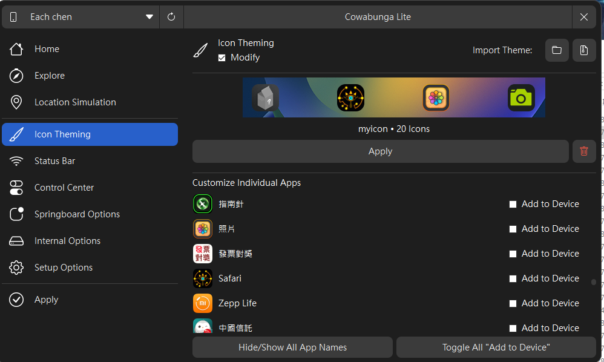
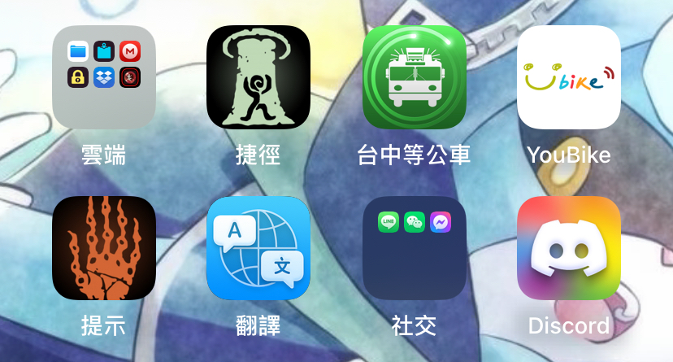

# App-icons
## What is this?
This is my app icon image used for my iPhone app. You can use [CowabungaLite](https://github.com/leminlimez/CowabungaLite) to change the app icon on iOS. I customized my icon and name with a bundle ID, which is a unique identifier in the Apple database that allows the OS to identify the app and apply the icon.

### How can I get bundle ID?
You can use [this tool](https://offcornerdev.com/bundleid.html)
## Image format

All of the icons are available in PNG and SVG formats. You can modify them if you wish. The recommended size for PNG is 256x256. Some of them may not meet the rules yet, but I will improve them as soon as possible.

----
You can certainly change the file name and apply it to another icon;; this is just my configuration and doesn't have to be the same as mine.
If you like those icon, pls give me a free star⭐Thank you
## demo

## More resource
- [Apple document ablout App icon](https://developer.apple.com/design/human-interface-guidelines/app-icons)
- [more icon](https://havoc.app)
  - Go to Themes filter you want
> power by figma
